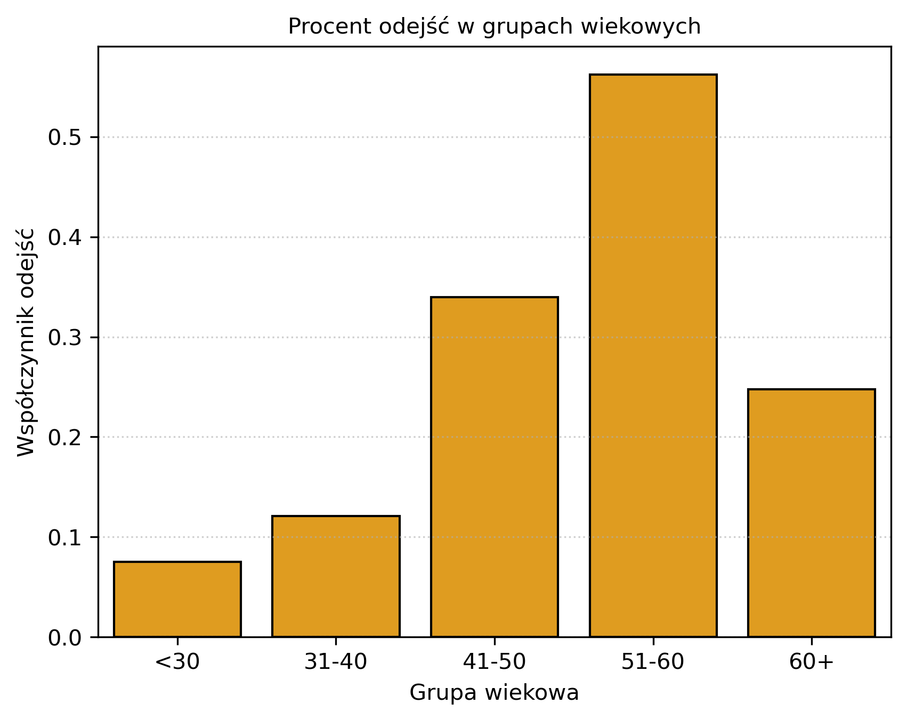
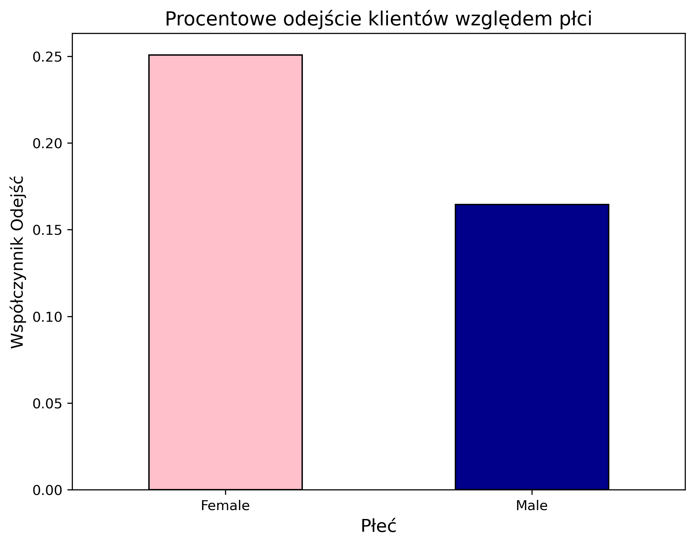
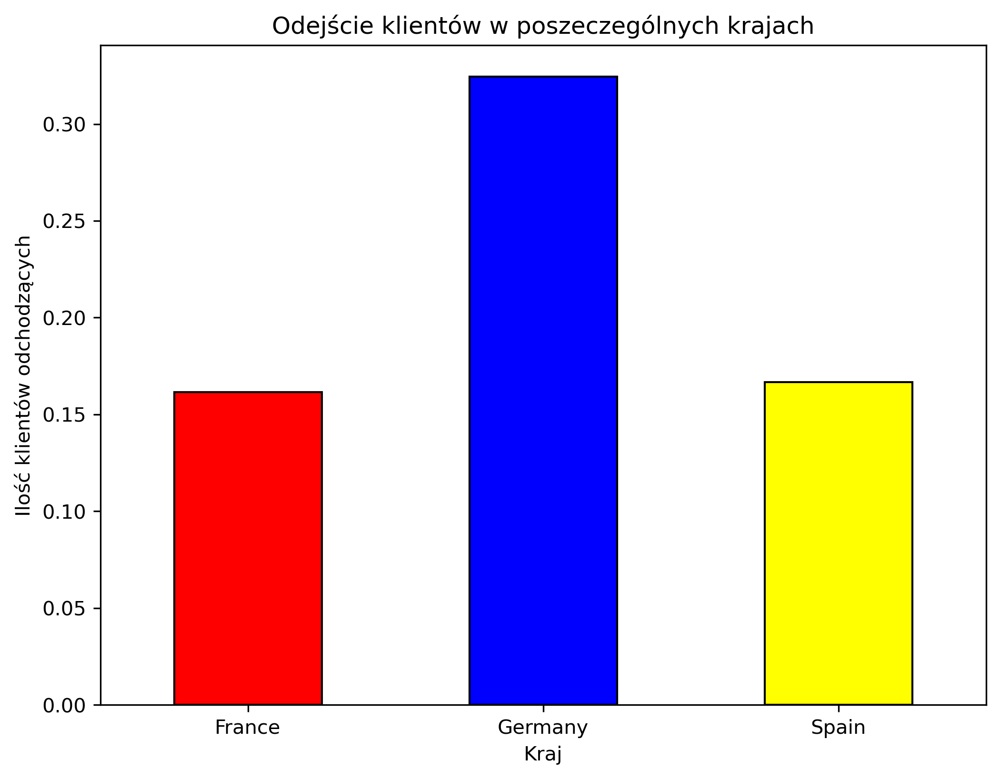
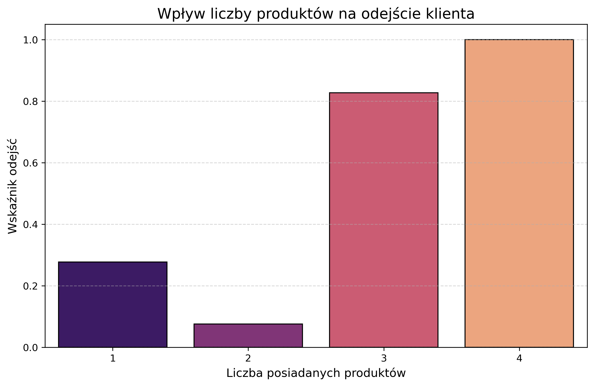
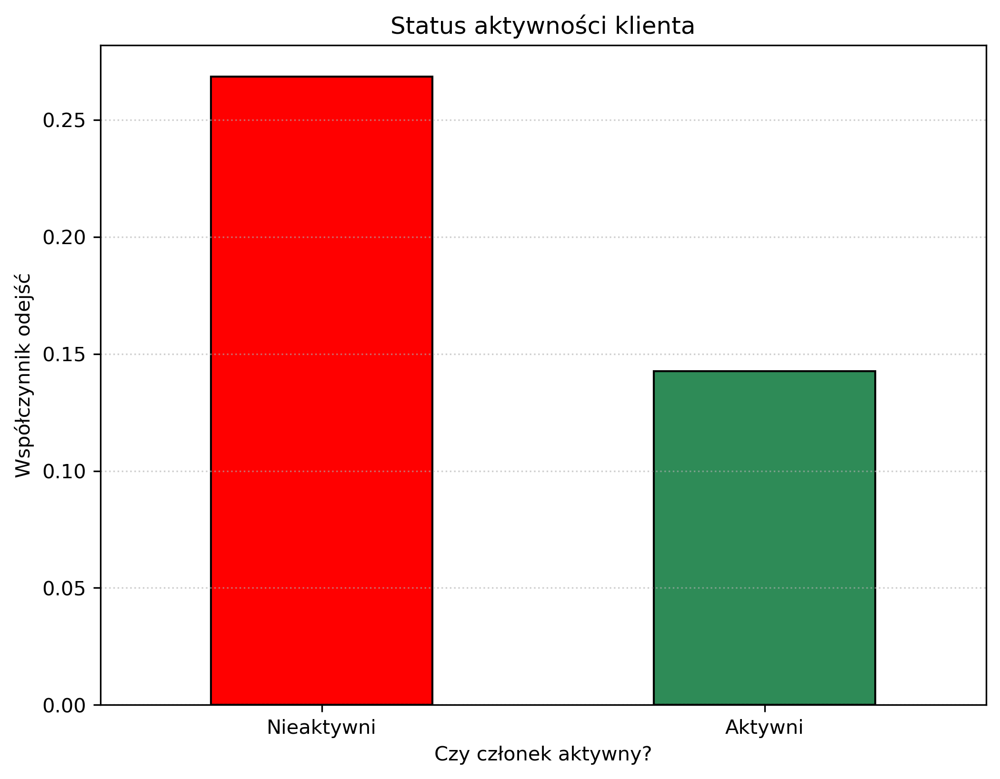
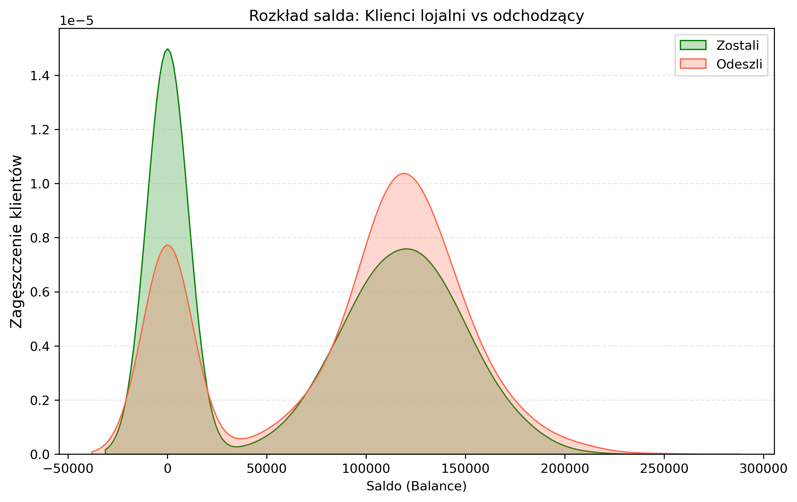
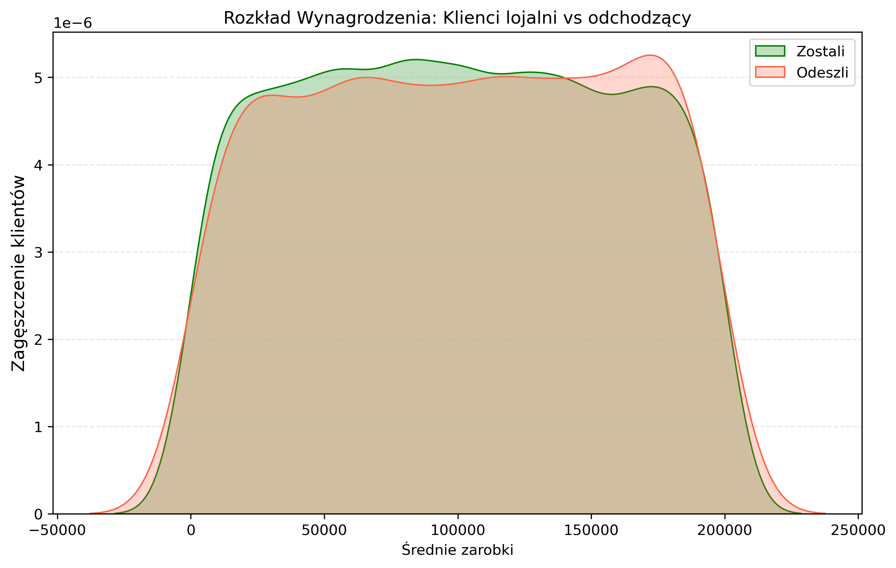
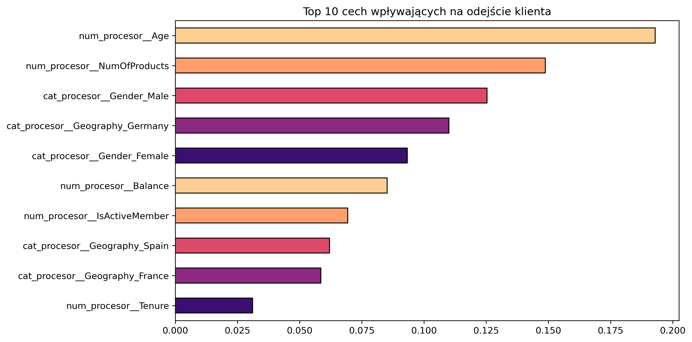

# Bank Churn Analysis & Prediction

##  Opis projektu
Projekt ma na celu identyfikację przyczyn odchodzenia klientów z banku oraz budowę modelu uczenia maszynowego, który z wykazuje wysoką skuteczność w wykrywaniu osób zagrożonych rezygnacją.  

Projekt łączy głęboką analizę eksploracyjną (EDA) z zaawansowanym modelowaniem predykcyjnym.

---

##  Kluczowe wnioski z Analizy Danych (EDA)

Z przeprowadzonej analizy wynikają następujące spostrzeżenia biznesowe:

###  Demografia ryzyka
- Największe prawdopodobieństwo odejścia występuje w grupie wiekowej **41–60 lat**  
- Jest to grupa zamożna, której utrzymanie powinno być priorytetem strategicznym banku  

---

- Statystycznie **kobiety odchodzą częściej niż mężczyźni**

###  Geografia
- Rynek niemiecki jest najbardziej krytyczny  
- Mimo że Francja posiada większą bazę klientów, to w Niemczech tracimy ich najszybciej (najwyższy współczynnik odejść)

###  Produkty i Aktywność
- Wskaźnik odejść drastycznie rośnie u klientów posiadających **powyżej 2 produktów**  

- Członkowie **nieaktywni odchodzą prawie dwukrotnie częściej** niż osoby aktywne  

###  Saldo konta (Balance)
- Paradoksalnie, klienci z **zerowym saldem rzadziej odchodzą** (prawdopodobnie przez brak zaangażowania)  
- Krytyczny odpływ kapitału obserwujemy u klientów z saldem **100,000 – 150,000 USD**  
- Jest to najbardziej dochodowa grupa, którą bank traci  

###  Zarobki
- Poziom wynagrodzenia (**Estimated Salary**) okazał się czynnikiem neutralnym  
- Rozkład zarobków w obu grupach (lojalni vs odchodzący) jest niemal identyczny  

---

##  Metodologia i Modelowanie

W procesie budowy modelu skupiłam się na radzeniu sobie z trudnymi, niezbalansowanymi danymi:

- **Preprocessing**  
  Usunięcie cech nieistotnych statystycznie (`CustomerId`, `Surname`) oraz zakodowanie zmiennych kategorycznych  

- **Balansowanie klas (Borderline-SMOTE)**  
  Ze względu na małą liczbę klientów odchodzących (~20%), zastosowałam Borderline-SMOTE, aby douczyć model na trudnych przypadkach z granicy klas  

- **Optymalizacja Hiperparametrów (Optuna)**  
  Zamiast tradycyjnego wyszukiwania, użyłam biblioteki Optuna do automatycznego znalezienia najlepszych parametrów modelu XGBoost w 50 próbach  

- **Walidacja**  
  Zastosowano Cross-Validation (`cv=3`) wewnątrz pętli Optuny, aby zapewnić stabilność wyników  

---

##  Wyniki Modelu (Final Performance)

Dzięki optymalizacji, model osiągnął wysoki poziom czułości, co jest kluczowe dla biznesu  
(lepiej wysłać ofertę lojalnościową do osoby lojalnej, niż przegapić klienta odchodzącego)

| Metryka            | Wynik (Próg 0.5) |
|--------------------|-----------------|
| Recall (Czułość)   | 0.77            |
| Precision          | 0.48            |
| F1-Score           | 0.59            |
| Accuracy           | 0.79            |

**Główny sukces:**  
Model poprawnie identyfikuje **77% wszystkich klientów**, którzy faktycznie zamierzają odejść,  
co stanowi ogromny wzrost w stosunku do bazowych modeli bez optymalizacji (**Recall ~0.58**)

---

## Rekomendacje Biznesowe

-  **Niemcy**  
  Skoncentrowanie działań retencyjnych na rynku niemieckim  

-  **Segment 40–60**  
  Stworzenie dedykowanych produktów dla osób w wieku dojrzałym z wysokim saldem (**100k–150k USD**)  

-  **Aktywacja**  
  Kampanie mające na celu zmianę statusu z *Inactive* na *Active* mogą zmniejszyć ryzyko odejścia o połowę  

---

##  Technologie

- **Data Analysis:** Pandas, Seaborn, Matplotlib  
- **Machine Learning:** XGBoost, Scikit-learn  
- **Sampling:** Imbalanced-learn (Borderline-SMOTE)  
- **Optimization:** Optuna  