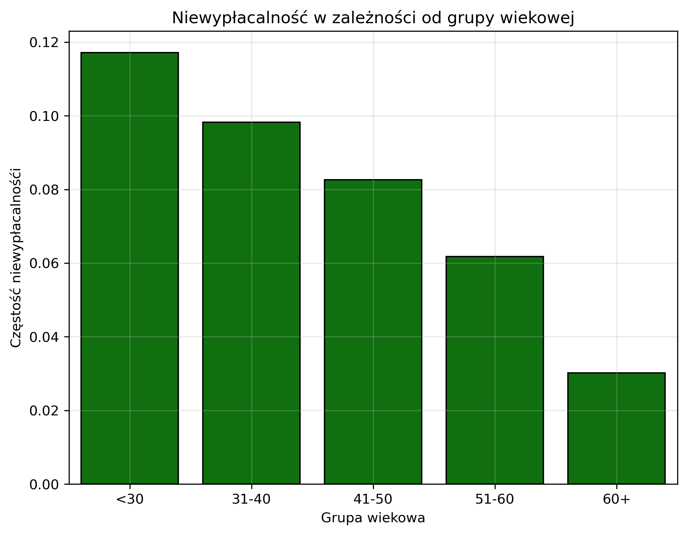
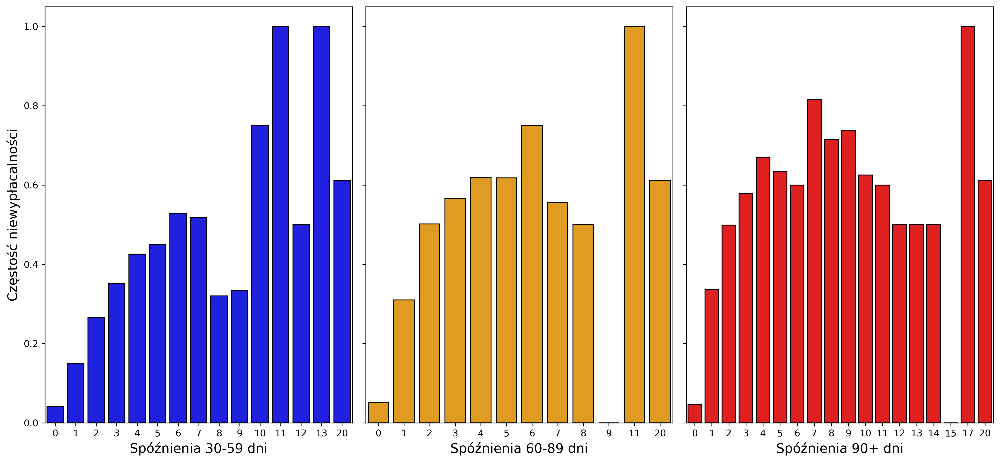
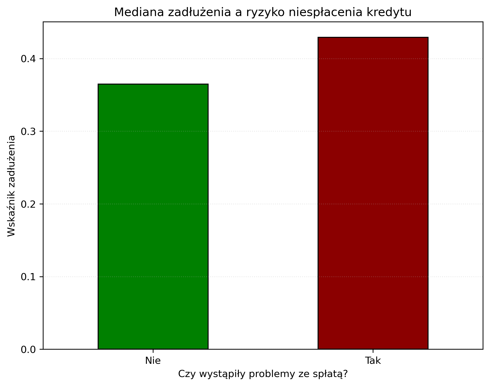
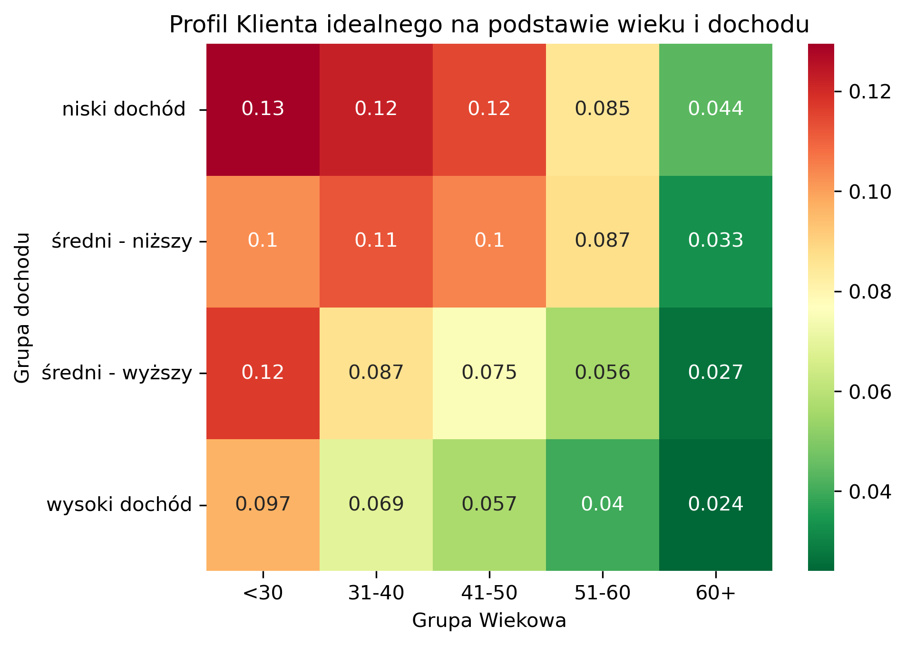

# Bank Credit Scoring – Predykcja niewypłacalności klientów

## Projekt w skrócie

Celem projektu było zbudowanie modelu machine learning przewidującego ryzyko niewypłacalności klienta banku w horyzoncie 2 lat (`SeriousDlqin2yrs`).

Projekt skupia się na:
- analizie danych finansowych (EDA),
- problemie niezbalansowanych klas,
- budowie pipeline’u ML end-to-end,
- interpretowalności modelu w kontekście biznesowym.

---

##  Cel biznesowy

Model ma wspierać decyzje kredytowe banku poprzez:

- identyfikację klientów wysokiego ryzyka,
- ograniczenie strat wynikających z defaultów,
- poprawę jakości decyzji scoringowych,
- minimalizację ryzyka portfela kredytowego.

---

##  Stack technologiczny

**Analiza danych i preprocessing:**
- Pandas
- NumPy
- Scikit-learn

**Modelowanie:**
- LightGBM
- XGBoost
- Random Forest

**Balansowanie klas:**
- BorderlineSMOTE (imbalanced-learn)

**Optymalizacja:**
- Optuna (Bayesian Optimization)

**Wizualizacja:**
- Matplotlib
- Seaborn

---

##  1. Exploratory Data Analysis (EDA)

###  Wiek a ryzyko kredytowe
Analiza wykazała silną zależność między wiekiem a ryzykiem niewypłacalności:

- osoby < 30 lat → najwyższe ryzyko,
- osoby 60+ → najniższe ryzyko i najwyższa stabilność finansowa.

 

---

###  Historia opóźnień – najsilniejszy predyktor ryzyka

Historia spóźnień w spłatach okazała się kluczowym czynnikiem:

- 90+ dni → bardzo silny sygnał niewypłacalności,
- 60–89 dni → umiarkowane ryzyko,
- 30–59 dni → wczesny sygnał ostrzegawczy.

  

---

###  Zadłużenie (Debt Ratio)

Po zastosowaniu mediany:

- wyeliminowano wpływ wartości odstających,
- potwierdzono, że osoby niewypłacalne mają wyższe zadłużenie względem dochodu,
- Debt Ratio jest silnym wskaźnikiem ryzyka kredytowego.

 

---

###  Profil klienta – analiza segmentowa

Analiza wieku i dochodu wykazała:

- stabilność finansowa rośnie wraz z wiekiem,
- dochód wzmacnia, ale nie dominuje wpływu wieku,
- najbardziej ryzykowna grupa: 31–40 lat z niskim dochodem.

 

---

##  2. Data Preparation & Feature Engineering

W ramach przygotowania danych zastosowano:

###  Czyszczenie danych
- uzupełnienie braków:
  - `MonthlyIncome` → mediana,
  - `NumberOfDependents` → moda,
- usunięcie duplikatów.

###  Obsługa wartości odstających
- clipping (1–99 percentyl),
- ograniczenie ekstremów w:
  - dochodach,
  - zadłużeniu,
  - wieku,
  - liczbie kredytów,
  - opóźnieniach.

###  Pipeline ML
- automatyzacja preprocessing’u,
- scaling danych numerycznych,
- encoding zmiennych kategorycznych.

---

##  Problem niezbalansowanych klas

Dane były silnie niezbalansowane, dlatego zastosowano:

###  BorderlineSMOTE

Efekty:
- poprawa wykrywania klasy mniejszości (dłużników),
- wzrost Recall,
- lepsza wrażliwość modelu na ryzyko.

---

##  3. Modelowanie

Testowane modele:
- Random Forest
- XGBoost
- LightGBM

###  Najlepszy model: LightGBM

LightGBM osiągnął najlepszy kompromis między:
- jakością predykcji,
- stabilnością,
- zdolnością do modelowania nieliniowości.

---

##  Wyniki modelu

###  Metryki końcowe:

- **ROC-AUC:** wysoki poziom separacji klas  
- **Recall:** 57% (wykrywanie dłużników)  
- **Accuracy:** 89%  
- **Precision:** umiarkowana (świadomy trade-off)  

---

##  Interpretacja biznesowa

###  Działanie modelu:

- skutecznie identyfikuje większość klientów wysokiego ryzyka,
- preferuje bezpieczeństwo portfela kredytowego,
- akceptuje większą liczbę false positives (świadoma decyzja biznesowa).

---

###  Wpływ biznesowy:

- 1150 poprawnie wykrytych dłużników,
- redukcja potencjalnych strat kredytowych,
- lepsze zarządzanie ryzykiem banku.

---

##  Feature Importance

Najważniejsze czynniki ryzyka:

-  **RevolvingUtilizationOfUnsecuredLines**  
  → kluczowy wskaźnik wykorzystania limitów kredytowych

-  **Historia opóźnień (30–90+ dni)**  
  → najsilniejszy predictor defaultu

-  **Wiek klienta**  
  → stabilność finansowa rośnie z wiekiem

-  **Dochód**  
  → czynnik wspierający, ale nie dominujący

---

##  Wnioski

- historia spłat jest najważniejszym predyktorem ryzyka,
- wiek silnie koreluje ze stabilnością finansową,
- SMOTE znacząco poprawia wykrywanie dłużników,
- LightGBM dobrze radzi sobie z nieliniowością danych finansowych,
- model nadaje się do zastosowań w systemach credit scoring.

---

