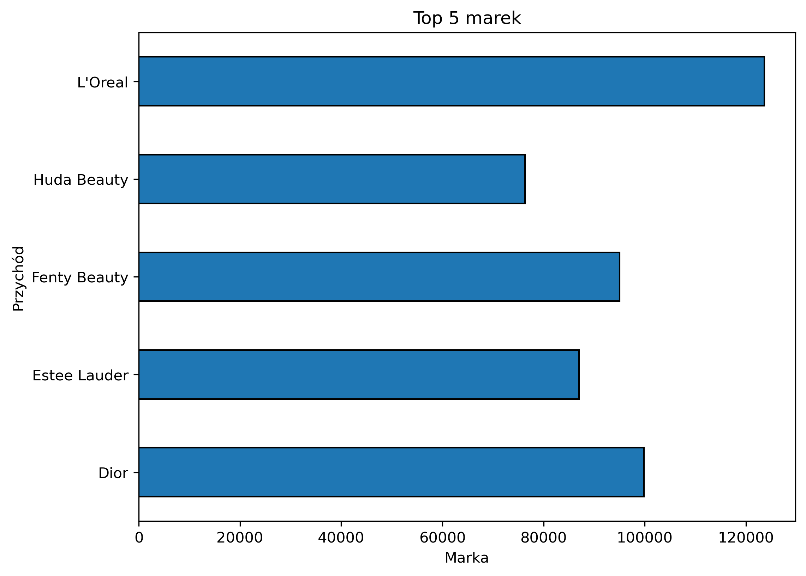
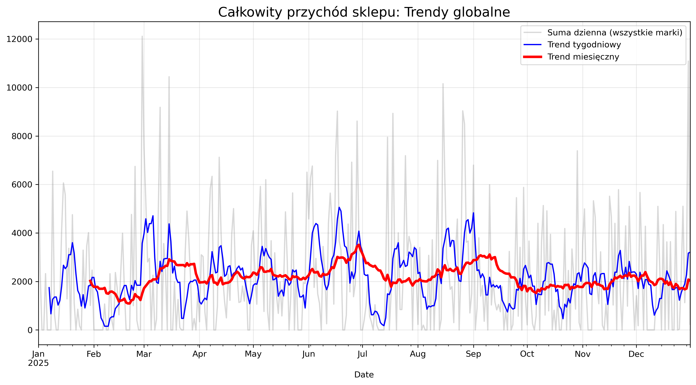
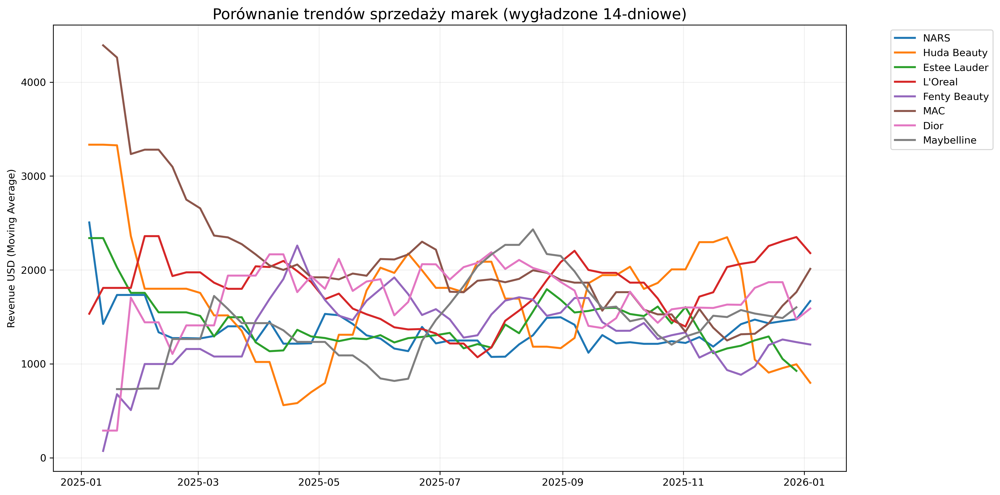
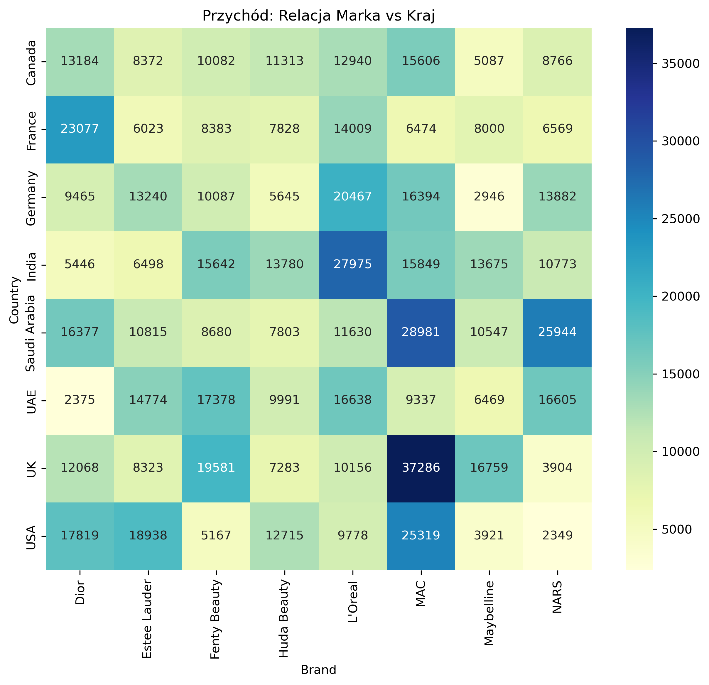
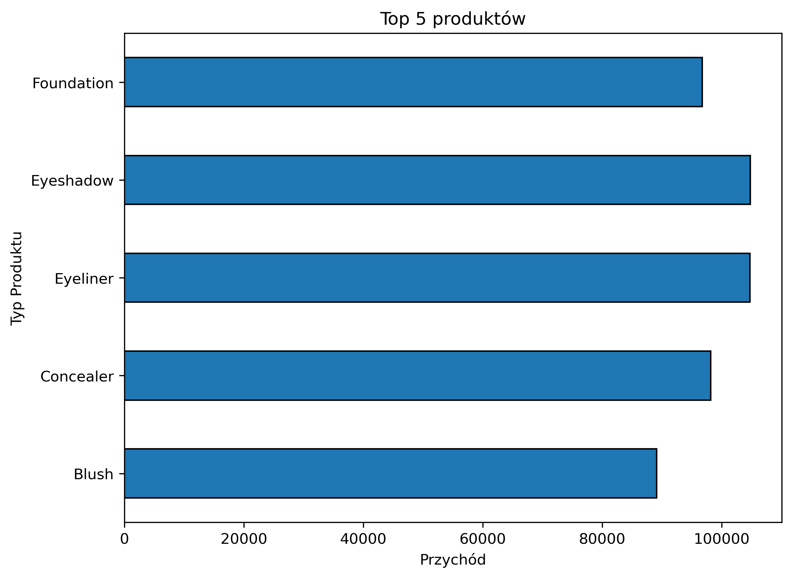
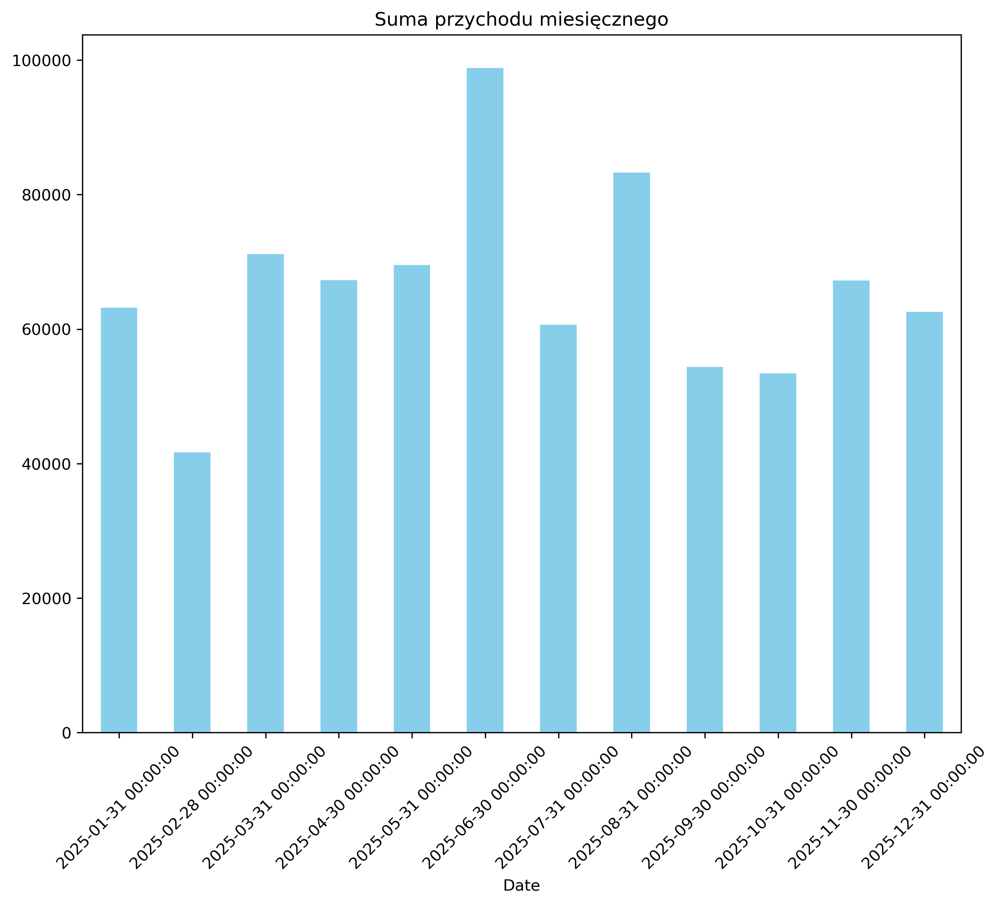
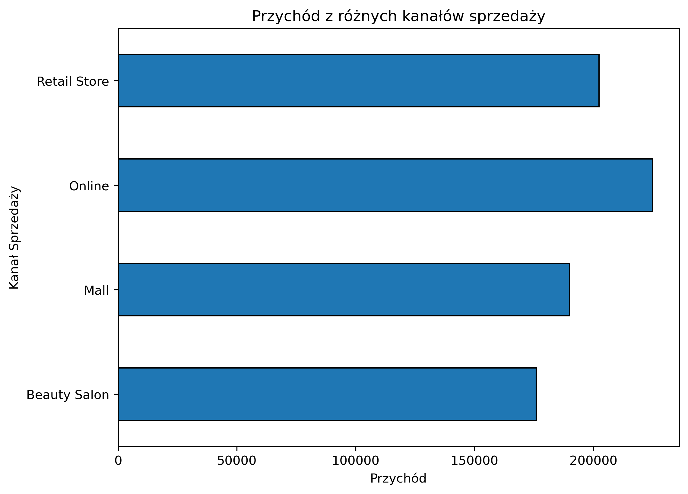

Makeup Sales Revenue Prediction & Analysis

Opis projektu:
Projekt ma na celu analizę trendów sprzedaży oraz budowę modelu uczenia maszynowego do przewidywania przychodu (Revenue_USD) w sektorze kosmetycznym. Wykorzystano techniki analizy szeregów czasowych (Time Series) oraz model Random Forest, aby zrozumieć, jakie czynniki (marka, kraj, kanał sprzedaży) mają największy wpływ na wynik finansowy.

Eksploracyjna Analiza Danych (EDA)
Proces EDA został podzielony na trzy etapy: od ogólnej kondycji biznesu po szczegółową segmentację marek.

1. Struktura Sprzedaży i Liderzy Rynkowi

Zidentyfikowano kluczowe marki i produkty generujące największy obrót.
-Wniosek: Top 5 marek odpowiada za znaczącą część całkowitego przychodu, co wskazuje na silną koncentrację rynku.
-Wykres: 

2. Globalne Trendy Czasowe (Macro View)Zastosowano agregację dzienną oraz średnie kroczące (7-dniową i 30-dniową), aby wyeliminować szum informacyjny i dostrzec realne trendy.

-Wniosek : Pomimo dużej zmienności dziennej, trend długoterminowy (czerwona linia) jest stabilny z lekką tendencją wzrostową w drugiej połowie roku.

-Wykres: 

3. Segmentacja Marek i Rzadkość Danych (Micro View)Szczegółowa analiza trendów dla poszczególnych brandów (z wykorzystaniem Weekly Resampling oraz Interpolacji) ujawniła, że każda marka posiada unikalną dynamikę sprzedaży.

-Wniosek: Marki luksusowe (np. Dior, MAC) charakteryzują się rzadszymi, ale wyższymi transakcjami, podczas gdy marki masowe wykazują większą regularność. To odkrycie uzasadniło wybór modelu nieliniowego.

-Wykres: 

4. Geografia i Kanały Sprzedaży Mapa ciepła (Heatmap) pozwoliła odkryć korelacje między krajem a preferencjami marek.

-Wniosek: Wyraźna dominacja określonych marek na konkretnych rynkach sugeruje konieczność personalizacji strategii marketingowych.

-Wykres: 

5. Portfolio produktowe

Dominacja Kategorii: Pięć najlepiej sprzedających się typów produktów odpowiada za znaczącą część całkowitego obrotu.

Struktura sprzedaży: Skupienie przychodu na kilku głównych kategoriach sugeruje, że portfolio jest zoptymalizowane, a klienci mają jasno określone preferencje zakupowe.

-Wykres: 

6. Sezonowość Miesięczna

Wykres pozwala szybko zidentyfikować miesiące o najwyższej wydajności sprzedażowej

Wnioski : Brak drastycznych spadków z miesiąca na miesiąc sugeruje zdrową strukturę popytu i brak problemów z dostępnością towaru

-Wykres: 

7. Kanały Sprzedaży 

Wnioski : Analiza wykazała silny model omnichannel, w którym głównym motorem zysków jest kanał Online. Sklepy stacjonarne  stanowią dla niego kluczowe uzupełnienie, generując przychód na zbliżonym poziomie. Obecność w centrach handlowych oraz salonach urody zapewnia marce pełną dywersyfikację i dotarcie do klienta w każdym istotnym punkcie styk

-Wykres: 

Modelowanie i Machine Learning 
Do przewidywania przychodu wykorzystano algorytm Random Forest Regressor.

Preprocessing:

- Usunięcie wartości odstających (Outliers) metodą IQR.Kodowanie zmiennych kategorycznych (Brand, Country, Sales_Channel) za pomocą One-Hot Encoding.

-Skalowanie cech numerycznych przy użyciu StandardScaler.

Wyniki modelu:
Po optymalizacji hiperparametrów (m.in. n_estimators, max_depth), model uzyskał następujące wyniki:

-Mean Absolute Error (MAE): 666.06 USD
-R-squared (R^2): 0.37

Komentarz techniczny: 
Wynik R^2 na poziomie 0.37 przy tak dużej zmienności dziennej i rzadkich danych (sparse data) jest satysfakcjonujący i wskazuje na poprawną identyfikację kluczowych czynników wpływających na sprzedaż.

Kluczowe Wnioski Biznesowe

Potencjał Kanałów: Sprzedaż w kanale [Online/In-store] generuje wyższą marżę, co sugeruje przesunięcie budżetów reklamowych.

Optymalizacja Zapasów: Dzięki analizie trendów tygodniowych możliwe jest lepsze planowanie stanów magazynowych dla kluczowych marek w okresach szczytowych.

Wartość Predykcji: Model pozwala na szacowanie przychodu z dokładnością do ~660 USD, co wspiera procesy budżetowania krótkoterminowego.