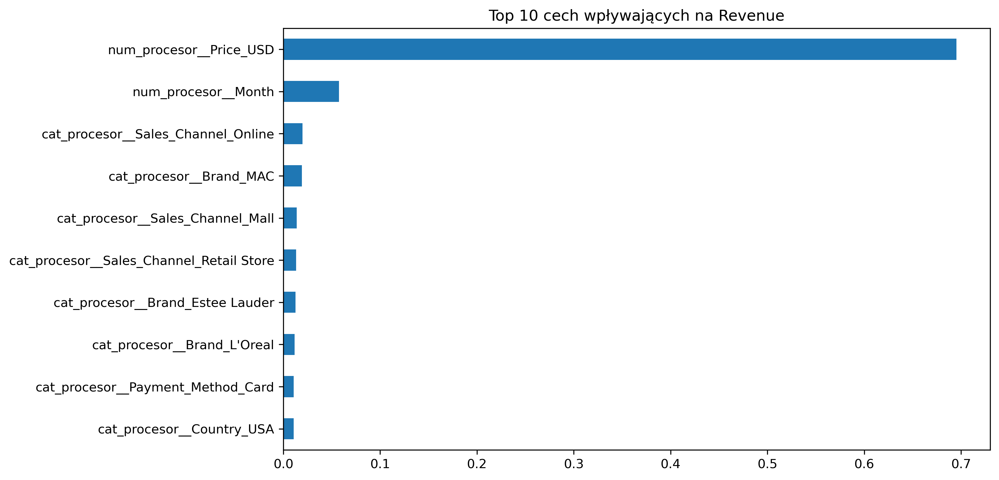

#  Makeup Sales Analysis & Revenue Prediction

##  Opis projektu
Projekt koncentruje się na analizie danych sprzedażowych produktów kosmetycznych oraz budowie modelu predykcyjnego, który szacuje dzienny przychód (Revenue).

Głównym wyzwaniem była duża zmienność dzienna oraz rozproszony charakter danych (sparse data), co jest typowe dla branży retail i e-commerce.

---

##  Eksploracyjna Analiza Danych (EDA)

###  Top 5 marek

**Wniosek:**  
Top 5 marek odpowiada za znaczącą część całkowitego przychodu, co wskazuje na silną koncentrację rynku.

---

###  Top 5 produktów

**Wnioski:**  
Pięć najlepiej sprzedających się typów produktów odpowiada za znaczącą część całkowitego obrotu.  

Struktura sprzedaży sugeruje jasno określone preferencje klientów.

---

###  Kanały sprzedaży

**Wnioski:**  
Model omnichannel — kanał Online jako główny motor sprzedaży, wspierany przez sklepy stacjonarne.

---

###  Marka vs Kraj (Heatmapa)

**Wniosek:**  
Dominacja konkretnych marek w wybranych krajach wskazuje na potrzebę personalizacji strategii marketingowej.

---

###  Trend globalny przychodu

**Wniosek:**  
Pomimo dużej zmienności dziennej, trend długoterminowy jest stabilny z lekką tendencją wzrostową.

---

###  Przychód miesięczny

**Wnioski:**  
Brak drastycznych spadków sugeruje stabilny popyt i dobrą dostępność produktów.

---

###  Trendy sprzedaży marek

**Wniosek:**  
Marki luksusowe mają rzadsze, ale większe transakcje, a masowe — stabilniejszą sprzedaż.

---

##  Preprocessing danych

- Usunięcie wartości odstających (Outliers) metodą IQR  
- Kodowanie zmiennych kategorycznych (One-Hot Encoding)  
- Skalowanie cech numerycznych (StandardScaler)  

---

##  Modelowanie i Machine Learning

Do przewidywania przychodu wykorzystano algorytm **Random Forest Regressor**.

Pipeline obejmuje:
- preprocessing danych (numeryczne + kategoryczne)
- model Random Forest
- automatyczną optymalizację hiperparametrów (Optuna)

---

##  Wyniki modelu

| Metryka                     | Wynik        |
|----------------------------|-------------|
| Mean Absolute Error (MAE)  | 666.06 USD  |
| R-squared (R²)             | 0.37        |

---

##  Komentarz techniczny

Wynik R² na poziomie 0.37 przy dużej zmienności dziennej i rzadkich danych jest satysfakcjonujący.  

Model poprawnie identyfikuje kluczowe czynniki wpływające na sprzedaż.

---

##  Feature Importance

---

##  Kluczowe Wnioski Biznesowe

- **Potencjał Kanałów:**  
  Kanały sprzedaży różnią się rentownością → warto przesunąć budżet marketingowy  

- **Optymalizacja Zapasów:**  
  Analiza trendów umożliwia lepsze zarządzanie magazynem  

- **Wartość Predykcji:**  
  Model przewiduje przychód z dokładnością ~660 USD → wsparcie dla budżetowania  

---

##  Technologie

- Python (Pandas, NumPy)  
- Scikit-learn (Random Forest, Pipeline)  
- Optuna (optymalizacja)  
- Matplotlib, Seaborn (wizualizacja)  